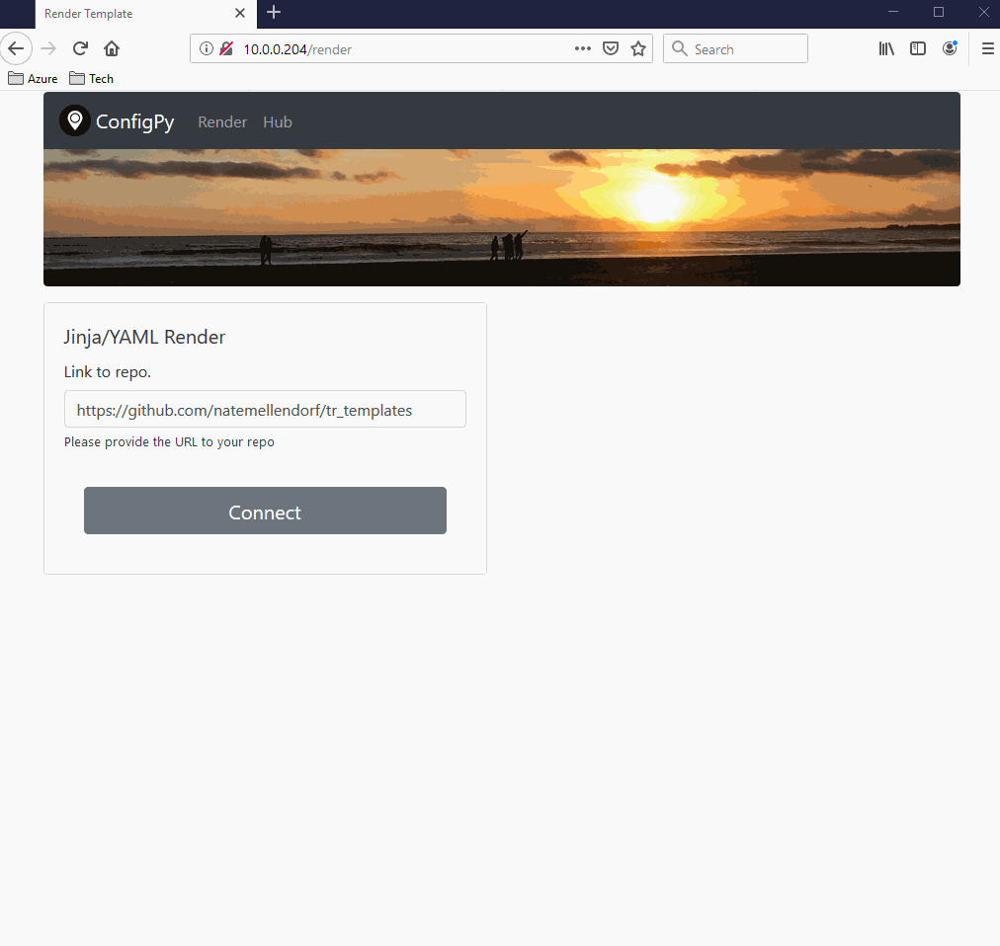
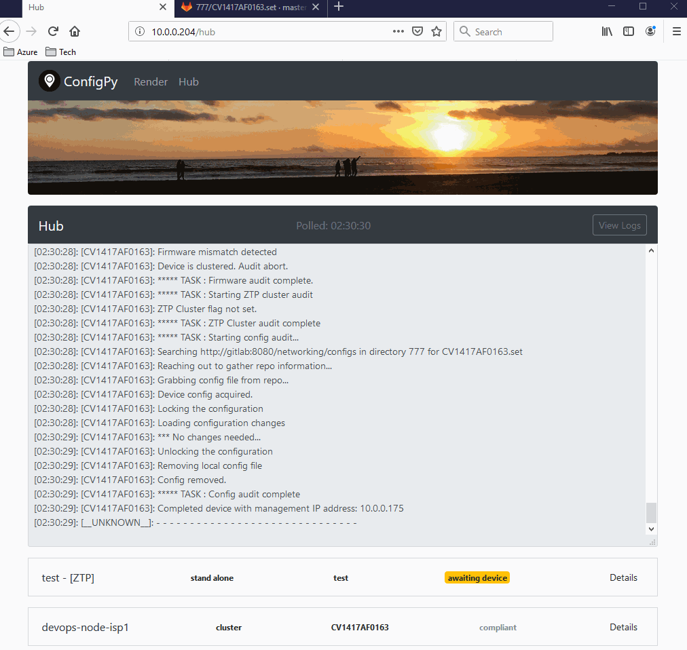

# ConfigPy
[](https://travis-ci.com/natemellendorf/configpy)
### Author:
Nate Mellendorf <br>
[https://www.linkedin.com/in/nathan-mellendorf/](https://www.linkedin.com/in/nathan-mellendorf/)<br>

## Overview:
ConfigPy was built to address the need for infrastructure as code for Junos devices.
It leverages Docker, Flask, SocketIO, Redis, PyEZ, Paramiko, and GitLab to:
- Create an OpenSSH server to listen for outbound SSH sessions from Junos devices.
- Once established, use PyEZ to gather facts about the connected Junos device.
- Store these device facts in a short lived centralized database.
- Perform additional tasks with PyEZ, such as auditing the Junos firmware and updating it.
- Sync the device config with a config file stored in a remote repository.
- If clustering is desired, leverage an op script and event manager to cluster the device.
- Leverage Jinja2 and YAML templating to create new configs, and push them to connected devices.

## Demos:
#### Template Rendering:


#### Device Config Sync


#### Notes from the author
ConfigPy was my first personal Python project, which I think is glaring when reviewing the code.
It introduced me to every dependancy that it leverages. Python (Flask, PyEZ, Requests), Redis, JavaScript, JQuery, CSS (Bootstrap), etc.
In it's current state, I would not recommend this project be placed outside of a lab environment.

### Deployment:
Configpy can be deployed on its own for basic template rendering.
If you want to leverage additional features noted above, then you'll need to update and deploy the containers below.
FIXME: I should leverage docker compose for this.
```
docker run --name redis \
  -d --restart always \
  -p 6379:6379 \
  --network production \
  redis

docker run --name configpy-node \
  -d --restart always \
  -p 9000:9000 \
  --network production \ 
  natemellendorf/configpy-node \  
  -user ztp \
  -password **secret** \ 
  -configpy_url http://10.0.0.204:80 \
  -redis_url redis \
  -repo_uri http://gitlab:8080/networking/configs \ 
  -repo_auth_token **secret** \
  -software_location http://10.0.0.204/static/firmware/ \ 
  -srx_firmware **shouldContainVersionInName-18.2R1.9.tgz \
  -srx_firmware_checksum **MD5checksum**
  
docker run --detach --hostname gitlab.example.com \
--publish 443:443 \
--publish 80:80 \
--publish 22:22 \
--name gitlab \
--restart always \
--volume /srv/gitlab/config:/etc/gitlab \
--volume /srv/gitlab/logs:/var/log/gitlab \
--volume /srv/gitlab/data:/var/opt/gitlab \
gitlab/gitlab-ce:latest

docker run --name configpy \
  -d --restart always \
  -e REDIS_URI=redis \
  -p 80:80 \
  --volume c:/dockerstorage/configpy/firmware:/home/devops/configpy/static/firmware \
  --network production \
  natemellendorf/configpy
```
  
### How to configure your Juniper device to connect
Remember to permit this traffic inbound on your mgmt interface.
```
set system services outbound-ssh client ztp device-id test-srx
set system services outbound-ssh client ztp services netconf
set system services outbound-ssh client ztp <DockerHost> port 9000
set system services outbound-ssh client ztp <DockerHost> timeout 120
```
